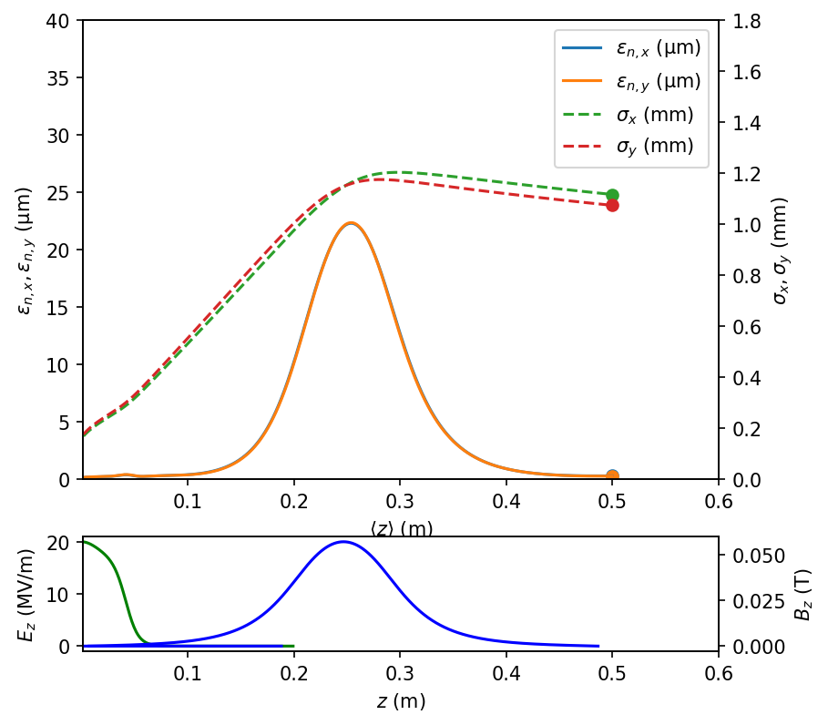

# LUME-Astra
Python wrapper for [ASTRA](http://www.desy.de/~mpyflo/) (A Space Charge Tracking Algorithm, DESY) for use in LUME.

**`Documentation`** |
------------------- |
[](https://christophermayes.github.io/lume-astra/)  |

```python
from astra import Astra

A = Astra('Astra.in')

A.verbose = True
A.run()
...
output = A.output
```




Installing lume-astra
=====================

Installing `lume-astra` from the `conda-forge` channel can be achieved by adding `conda-forge` to your channels with:

```
conda config --add channels conda-forge
```

Once the `conda-forge` channel has been enabled, `lume-astra` can be installed with:

```
conda install lume-astra
```

It is possible to list all of the versions of `lume-astra` available on your platform with:

```
conda search lume-astra --channel conda-forge

```


Installing Astra Executables
=====================

For convenience, you can set `$ASTRA_BIN` and `$GENERATOR_BIN` to point to the Astra and generator binaries for your system. See the [install_astra.ipynb](./examples/install_astra.ipynb) example for easy installation.


## Basic usage

See [simple_astra_run.ipynb](./examples/basic_astra_examples.ipynb). In short:

```python
from astra import Astra

A = Astra('../templates/Astra.in')

A.verbose = True
A.run()
...
output = A.output
```


